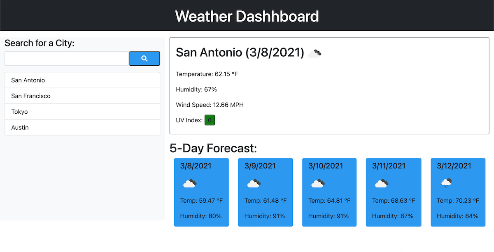

# weather_dashboard

## Description
    This is a weather outlook page for the purpose of planning a trip. The site utilizes the third-party API, OpenWeather, to access and display weather information in a web based dashboard.

## Site Screenshot
   

## Site Link
   Link to [Weather Dashboard](https://takolad.github.io/weather_dashboard/).